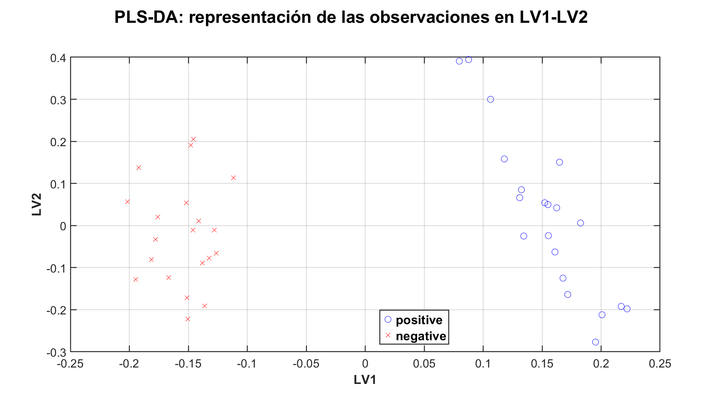

# Inteligencia Artificial Explicativa sobre BERT mediante mapas de atención, PCA, oMEDA, SHAP, PLS-DA y ASCA

Repositorio asociado al Trabajo Fin de Grado:

# Inteligencia Artificial Explicativa (XAI): Métodos y Prueba de Concepto

**Autor:** Adrián Macias Caballero  
**Tutor académico:** José Camacho Páez  
**Universidad:** Universidad de Granada  
**Titulación:** Grado en Ingeniería de Tecnologías de Telecomunicación  
**Área:** Inteligencia Artificial Explicativa, Procesamiento del Lenguaje Natural y Análisis Multivariante  

---

## Resumen

Este repositorio contiene el código, los datos experimentales, los scripts de análisis y los resultados principales desarrollados en el Trabajo Fin de Grado **“Inteligencia Artificial Explicativa (XAI): Métodos y Prueba de Concepto”**.

El trabajo se centra en el estudio de la Inteligencia Artificial Explicativa, conocida como **XAI** (*Explainable Artificial Intelligence*), aplicada a modelos de lenguaje basados en arquitecturas Transformer. En concreto, se desarrolla una prueba de concepto sobre un modelo **BERT** previamente ajustado para clasificación binaria de sentimiento.

El objetivo principal no es entrenar un nuevo modelo, sino analizar el comportamiento interno de un modelo ya entrenado. Para ello, se extraen los mapas de atención generados por BERT al procesar un conjunto controlado de frases positivas y negativas. Estas atenciones se transforman posteriormente en una matriz de datos de alta dimensión, sobre la que se aplican distintas técnicas exploratorias, explicativas y multivariantes.

Los métodos principales utilizados son:

- **PCA**: *Principal Component Analysis*.
- **oMEDA**: análisis de contribución de variables basado en MEDA.
- **SHAP**: *SHapley Additive exPlanations*.
- **PLS-DA**: *Partial Least Squares Discriminant Analysis*.
- **ASCA**: *ANOVA-Simultaneous Component Analysis*.

El proyecto combina herramientas de **Python**, **Hugging Face Transformers**, **PyTorch**, **SHAP** y **MATLAB** para construir un flujo completo de análisis explicativo.

---

## Motivación

Los modelos actuales de inteligencia artificial han alcanzado un rendimiento muy elevado en tareas complejas como clasificación, visión por computador y procesamiento del lenguaje natural. Sin embargo, este aumento de capacidad predictiva ha venido acompañado de una pérdida de transparencia.

Muchos modelos de aprendizaje profundo funcionan como sistemas de **caja negra**: generan predicciones precisas, pero resulta difícil comprender qué información han utilizado, qué patrones internos han aprendido o por qué toman una decisión concreta.

Esta falta de interpretabilidad es especialmente relevante en arquitecturas modernas basadas en **Transformers**, como BERT, donde el procesamiento interno se distribuye entre múltiples capas, cabezas de atención y representaciones contextuales.

La Inteligencia Artificial Explicativa surge como respuesta a este problema. Su objetivo es proporcionar herramientas que permitan analizar, interpretar y evaluar el comportamiento de modelos complejos, facilitando una comprensión más razonada de sus decisiones.

Este trabajo parte de esa motivación y plantea una pregunta central:

> ¿Es posible utilizar los mapas de atención de BERT, combinados con técnicas de análisis multivariante y métodos de atribución, para estudiar de forma más interpretable su comportamiento interno en una tarea de clasificación de sentimiento?

---

## Objetivos del proyecto

El objetivo principal del trabajo es estudiar la aplicabilidad de diferentes técnicas de Inteligencia Artificial Explicativa sobre un modelo BERT aplicado a clasificación binaria de sentimiento.

Los objetivos específicos son:

1. Estudiar los fundamentos de los modelos de inteligencia artificial, desde técnicas tradicionales de Machine Learning hasta modelos de aprendizaje profundo y arquitecturas Transformer.

2. Analizar el campo de la Inteligencia Artificial Explicativa, incluyendo métodos de explicabilidad de datos, explicabilidad de modelos y técnicas post-hoc.

3. Seleccionar un modelo BERT previamente ajustado para clasificación de sentimiento.

4. Construir un conjunto experimental controlado de frases positivas y negativas.

5. Extraer los mapas de atención generados por BERT para cada frase.

6. Transformar las matrices de atención en una matriz numérica de alta dimensión.

7. Aplicar PCA para estudiar la estructura global de las observaciones.

8. Implementar oMEDA para identificar variables internas de atención relevantes.

9. Comparar los resultados con SHAP como método de atribución sobre tokens reales.

10. Aplicar PLS-DA para estudiar la capacidad discriminante de las variables de atención.

11. Aplicar ASCA para analizar el efecto del factor clase sobre la estructura de atención.

12. Comparar la importancia obtenida por capas, cabezas, posiciones de token y tokens reales.

13. Extraer conclusiones sobre la utilidad y las limitaciones de combinar estas técnicas en el análisis explicativo de modelos BERT.

---

## Modelo utilizado

El modelo utilizado en este trabajo es:

```text
textattack/bert-base-uncased-SST-2
```

Se trata de un modelo basado en **BERT-base** y ajustado para una tarea de clasificación binaria de sentimiento.

| Característica | Valor |
|---|---|
| Arquitectura base | BERT-base |
| Tipo de arquitectura | Transformer encoder |
| Tarea | Clasificación binaria de sentimiento |
| Clases | Positiva / Negativa |
| Tokenización | WordPiece |
| Modelo uncased | Sí |
| Número de capas | 12 |
| Cabezas de atención por capa | 12 |
| Longitud usada en el experimento | 8 tokens |

En este proyecto, el modelo recibe frases en inglés y devuelve una predicción de sentimiento junto con las probabilidades asociadas a cada clase.

---

## Fundamento del caso práctico

BERT procesa cada frase mediante una arquitectura formada por varias capas Transformer. En cada capa existen distintas cabezas de atención que calculan relaciones entre los tokens de entrada.

Para cada frase, el modelo genera mapas de atención con la siguiente estructura:

```text
Capas × Cabezas × Token origen × Token destino
```

En este trabajo se fija una longitud de entrada de 8 tokens. Por tanto, para cada frase se obtiene:

```text
12 capas × 12 cabezas × 8 tokens origen × 8 tokens destino = 9216 variables de atención
```

Como el conjunto experimental contiene 40 frases, la matriz final de análisis tiene dimensión:

```text
40 observaciones × 9216 variables
```

Cada fila representa una frase y cada columna representa una relación concreta de atención definida por:

```text
Capa - Cabeza - Token origen - Token destino
```

Esta matriz constituye la base común para los análisis mediante PCA, oMEDA, PLS-DA y ASCA.

---

## Conjunto experimental

El conjunto experimental está formado por 40 frases:

- 20 frases positivas.
- 20 frases negativas.

Las frases se han construido de forma pareada. Para cada frase positiva existe una frase negativa con estructura muy similar, modificando principalmente el término que introduce la polaridad sentimental.

Este diseño permite controlar parcialmente la variabilidad lingüística y centrar el análisis en las diferencias asociadas al sentimiento.

### Frases positivas

```text
1.  The movie was very good.
2.  This film was really nice.
3.  I found the story charming.
4.  The acting felt quite natural.
5.  This movie looked very beautiful.
6.  The ending was truly satisfying.
7.  I enjoyed this film today.
8.  The plot felt warm throughout.
9.  This was a lovely movie.
10. The cast gave strong performances.
11. I liked the final scene.
12. This film felt deeply moving.
13. The soundtrack was very pleasant.
14. The script was smart overall.
15. I found it quite enjoyable.
16. The movie felt fresh today.
17. This story was very warm.
18. The pacing worked very well.
19. I loved this movie completely.
20. The dialogue felt sharp throughout.
```

### Frases negativas

```text
1.  The movie was very bad.
2.  This film was really awful.
3.  I found the story boring.
4.  The acting felt quite wooden.
5.  This movie looked very cheap.
6.  The ending was truly annoying.
7.  I disliked this film today.
8.  The plot felt weak throughout.
9.  This was a dreadful movie.
10. The cast gave poor performances.
11. I hated the final scene.
12. This film felt deeply empty.
13. The soundtrack was very unpleasant.
14. The script was dumb overall.
15. I found it quite painful.
16. The movie felt stale today.
17. This story was very dull.
18. The pacing worked very poorly.
19. I hated this movie completely.
20. The dialogue felt flat throughout.
```

---

## Flujo experimental

El flujo general seguido en el proyecto es el siguiente:

```text
Frases positivas y negativas
        ↓
Tokenización con BERT
        ↓
Predicción de sentimiento
        ↓
Extracción de mapas de atención
        ↓
Construcción de la matriz X: 40 × 9216
        ↓
Análisis PCA
        ↓
Análisis oMEDA
        ↓
Análisis SHAP
        ↓
Análisis PLS-DA
        ↓
Análisis ASCA
        ↓
Comparación global de resultados
```

El flujo combina dos entornos principales:

- **Python**, para cargar el modelo BERT, tokenizar las frases, obtener predicciones, extraer mapas de atención y calcular SHAP.
- **MATLAB**, para aplicar PCA, oMEDA, PLS-DA, ASCA y generar gran parte de los análisis multivariantes.
---

# Metodología

## 1. Extracción de mapas de atención

La primera fase práctica consiste en cargar el modelo BERT y aplicarlo al conjunto experimental de frases.

Para cada frase se realiza:

1. Tokenización con el tokenizador asociado al modelo.
2. Obtención de la predicción de sentimiento.
3. Extracción de las probabilidades asociadas a las clases positiva y negativa.
4. Extracción de los mapas de atención de todas las capas y cabezas.
5. Vectorización de las matrices de atención.
6. Construcción de la matriz final de análisis.

El resultado es una matriz numérica de dimensión:

```text
40 × 9216
```

donde cada fila representa una frase y cada columna una variable de atención.

---

## 2. PCA

**PCA** significa *Principal Component Analysis*, o **Análisis de Componentes Principales**.

Es una técnica exploratoria no supervisada que permite reducir la dimensionalidad de los datos manteniendo la mayor parte posible de la variabilidad original.

En este proyecto, PCA se aplica sobre la matriz de atención para estudiar si las frases positivas y negativas presentan una estructura diferenciada en un espacio de menor dimensión.

### Objetivo de PCA en el trabajo

PCA se utiliza para:

- Explorar la estructura global de las observaciones.
- Representar las frases en un espacio latente de menor dimensión.
- Analizar si existe separación natural entre frases positivas y negativas.
- Estudiar la varianza explicada por las componentes principales.
- Servir como base para el análisis posterior mediante oMEDA.

### Interpretación

Cada observación del PCA corresponde a una frase del conjunto experimental. Si los patrones de atención fueran muy diferentes entre frases positivas y negativas, cabría esperar cierta separación entre ambos grupos en las primeras componentes principales.

Sin embargo, los resultados muestran que esta separación no aparece de forma completamente clara en las primeras componentes. Esto indica que la información relevante para la clasificación no se organiza de manera simple y lineal en un plano bidimensional.

El resultado no significa que las atenciones no contengan información útil, sino que dicha información está distribuida en múltiples dimensiones internas.

---

## 3. oMEDA

**oMEDA** se utiliza como una herramienta para analizar qué variables originales contribuyen a una diferencia observada en el espacio latente.

En este trabajo, oMEDA permite proyectar la diferencia entre frases positivas y negativas desde el espacio PCA hacia el espacio original de variables de atención.

Cada variable de la matriz original representa una relación concreta:

```text
Capa - Cabeza - Token origen - Token destino
```

Por tanto, oMEDA permite identificar qué relaciones internas de atención contribuyen más a diferenciar las frases positivas de las negativas.

### Objetivo de oMEDA en el trabajo

oMEDA se utiliza para:

- Identificar variables de atención relevantes.
- Analizar la contribución de cada capa.
- Estudiar la importancia de cada cabeza de atención.
- Localizar relaciones token-token destacadas.
- Comparar la importancia de token origen y token destino.
- Estudiar si las capas finales de BERT tienen mayor peso en la diferencia entre clases.

### Interpretación

Los resultados muestran que la mayoría de variables tienen una contribución reducida, pero existe un subconjunto de variables con valores destacados.

Al agrupar la importancia por capas, se observa que las capas finales tienden a concentrar una mayor contribución. Este resultado es coherente con la idea de que las capas superiores de BERT contienen representaciones más abstractas y más relacionadas con la tarea final.

El análisis por capa y cabeza muestra además que no todas las cabezas de atención contribuyen por igual. Algunas cabezas presentan valores más elevados, lo que sugiere una posible especialización funcional dentro del modelo.

---

## 4. SHAP

**SHAP** significa *SHapley Additive exPlanations*.

Es un método de explicabilidad basado en valores de Shapley, procedentes de la teoría de juegos. Su objetivo es asignar a cada característica de entrada una contribución respecto a la predicción del modelo.

En este trabajo, SHAP se utiliza como método de comparación porque trabaja directamente sobre los tokens reales de entrada, no sobre las variables internas de atención.

### Objetivo de SHAP en el trabajo

SHAP se utiliza para:

- Explicar predicciones individuales del modelo.
- Identificar qué tokens reales influyen más en la predicción final.
- Obtener rankings globales de importancia de palabras.
- Comparar la importancia léxica con la importancia estructural obtenida por oMEDA, PLS-DA y ASCA.

### Diferencia con los métodos basados en atención

Una idea clave del trabajo es que SHAP y los métodos basados en atención no explican exactamente lo mismo.

```text
SHAP:
    Importancia directa sobre tokens reales de entrada.

oMEDA, PLS-DA y ASCA:
    Importancia estructural sobre variables internas de atención.
```

Por tanto, SHAP permite acercar la interpretación al lenguaje natural, mostrando qué palabras influyen más directamente en la decisión del clasificador.

### Interpretación

Los resultados de SHAP destacan principalmente términos con carga semántica o sentimental. Esto resulta esperable, ya que el modelo ha sido ajustado para clasificación de sentimiento.

SHAP permite comprobar si palabras como `good`, `bad`, `awful`, `dreadful`, `poorly`, `sharp`, `painful` o `disliked` tienen una contribución destacada sobre la predicción final.

Este análisis complementa a los métodos basados en atención, ya que permite relacionar los patrones internos del modelo con palabras reales interpretables por una persona.

---

## 5. PLS-DA

**PLS-DA** significa *Partial Least Squares Discriminant Analysis*.

En español puede entenderse como **Análisis Discriminante por Mínimos Cuadrados Parciales**.

A diferencia de PCA, PLS-DA es un método supervisado. Esto significa que utiliza las etiquetas de clase durante el ajuste del modelo.

En este trabajo, PLS-DA se aplica para comprobar si las variables internas de atención contienen información discriminante suficiente para separar frases positivas y negativas.

### Objetivo de PLS-DA en el trabajo

PLS-DA se utiliza para:

- Analizar la separación supervisada entre clases.
- Comprobar la capacidad discriminante de las variables de atención.
- Representar las observaciones en variables latentes.
- Calcular predicciones continuas.
- Evaluar el rendimiento mediante matriz de confusión.
- Estudiar coeficientes del modelo.
- Calcular puntuaciones VIP.
- Comparar la importancia obtenida con oMEDA.

### Interpretación

Los resultados obtenidos mediante PLS-DA muestran una separación más clara entre frases positivas y negativas que PCA.

Esto se debe a que PLS-DA utiliza la información de clase durante el ajuste. Por tanto, busca direcciones latentes que maximicen la relación entre las variables de atención y la etiqueta de sentimiento.

El análisis indica que las matrices de atención contienen información útil para discriminar entre ambas clases. Sin embargo, este resultado debe interpretarse con prudencia, ya que el conjunto experimental es reducido y está construido de forma controlada.

La comparación entre PLS-DA y oMEDA muestra una alta coherencia en la importancia por capas, especialmente en la relevancia de las capas finales del modelo.

---

## 6. ASCA

**ASCA** significa *ANOVA-Simultaneous Component Analysis*.

En español puede entenderse como **Análisis de Componentes Simultáneos basado en ANOVA**.

ASCA combina ideas del análisis de varianza con análisis de componentes. En este trabajo se utiliza como una técnica exploratoria para estudiar el efecto del factor clase sobre la matriz de atención.

El factor principal considerado es:

```text
Clase = positiva / negativa
```

### Objetivo de ASCA en el trabajo

ASCA se utiliza para:

- Estudiar el efecto del factor clase sobre las atenciones.
- Analizar la diferencia global entre frases positivas y negativas.
- Obtener scores asociados al efecto de clase.
- Estudiar importancia por capas.
- Estudiar importancia por cabezas de atención.
- Analizar importancia por token origen y token destino.
- Visualizar diferencias de atención por pares de tokens.
- Comparar sus resultados con PCA, oMEDA, SHAP y PLS-DA.

### Interpretación

ASCA permite estudiar si la polaridad de la frase introduce un efecto apreciable sobre la estructura interna de atención.

Los resultados muestran que el factor clase genera diferencias en determinadas zonas de la matriz de atención. De nuevo, las capas finales aparecen como zonas especialmente relevantes.

ASCA aporta una perspectiva distinta al resto de métodos, ya que no actúa como clasificador, sino como herramienta exploratoria basada en diseño experimental.

---

# Comparación entre métodos

Uno de los puntos centrales del trabajo es que los métodos aplicados no explican exactamente el mismo nivel del modelo.

| Método | Tipo de análisis | Nivel de interpretación | Uso principal |
|---|---|---|---|
| PCA | Exploratorio no supervisado | Estructura global | Visualizar observaciones |
| oMEDA | Contribución de variables | Variables internas de atención | Detectar variables relevantes |
| SHAP | Atribución post-hoc | Tokens reales | Explicar predicciones |
| PLS-DA | Supervisado discriminante | Separación entre clases | Validar capacidad discriminante |
| ASCA | Exploratorio basado en ANOVA | Efecto de clase | Estudiar efecto experimental |

---

## Importancia estructural e importancia léxica

Una de las conclusiones más importantes del trabajo es la diferencia entre dos niveles de interpretación.

### Importancia estructural

Es la importancia asociada a elementos internos del modelo:

- Capas.
- Cabezas de atención.
- Posiciones de token.
- Relaciones token origen-token destino.
- Variables internas de la matriz de atención.

Esta importancia es la que proporcionan principalmente:

```text
oMEDA, PLS-DA y ASCA
```

Estos métodos no asignan importancia directamente a una palabra como unidad semántica independiente, sino a la posición que ocupa dentro de la estructura de atención y a las relaciones internas en las que participa.

### Importancia léxica

Es la importancia asociada directamente a palabras o tokens reales de entrada.

Esta importancia es la que proporciona principalmente:

```text
SHAP
```

SHAP permite identificar qué palabras concretas influyen más directamente en la predicción final del clasificador.

---

## Comparación por tokens reales

En el trabajo también se realiza una comparación entre los tokens reales destacados por SHAP y la importancia estructural obtenida mediante oMEDA, PLS-DA y ASCA.

Esta comparación debe interpretarse con cuidado.

SHAP calcula importancia directamente sobre tokens reales. En cambio, oMEDA, PLS-DA y ASCA calculan importancia sobre posiciones y variables internas de atención. Para compararlos, se proyecta la importancia posicional sobre las palabras reales que ocupan esas posiciones.

Esto permite comparar ambos niveles, pero no significa que todos los métodos midan exactamente lo mismo.

Una palabra puede ser relevante por dos motivos distintos:

1. Porque influye directamente en la predicción final, como muestra SHAP.

2. Porque aparece en una posición relevante dentro de la estructura de atención, como muestran oMEDA, PLS-DA y ASCA.

Esta distinción es fundamental para evitar interpretaciones simplistas.

---

# Resultados principales

Los resultados obtenidos pueden resumirse en los siguientes puntos:

1. Los mapas de atención de BERT contienen una estructura interna apreciable.

2. PCA muestra que no existe una separación lineal simple entre frases positivas y negativas en las primeras componentes principales.

3. La varianza explicada está distribuida entre varias componentes, lo que indica que el comportamiento interno del modelo no puede resumirse completamente en dos dimensiones.

4. oMEDA identifica variables de atención que contribuyen de forma diferenciada a la comparación entre frases positivas y negativas.

5. Las capas finales de BERT tienden a concentrar una mayor importancia en los análisis basados en atención.

6. No todas las cabezas de atención contribuyen por igual, lo que sugiere cierta especialización funcional dentro del modelo.

7. SHAP destaca tokens reales con carga semántica o sentimental, proporcionando una explicación más cercana a la predicción final.

8. PLS-DA muestra que las variables de atención contienen información discriminante entre clases.

9. ASCA permite analizar el efecto del factor clase sobre la estructura completa de atención.

10. La comparación global indica que ningún método proporciona por sí solo una explicación completa.

---

# Figuras destacadas

## PCA

```markdown

```

## oMEDA

```markdown

```

## SHAP

```markdown

```

## PLS-DA

```markdown

```

## ASCA

```markdown

```

## Comparación global

```markdown

```

---

# Dependencias principales

El análisis en Python utiliza:

```text
numpy
pandas
matplotlib
scikit-learn
scipy
torch
transformers
shap
tqdm
jupyter
```

El análisis multivariante se desarrolla principalmente en MATLAB.

---

# Interpretación de los resultados

La interpretación del proyecto debe realizarse con cautela.

Los mapas de atención permiten observar relaciones internas entre tokens, pero no deben interpretarse automáticamente como una explicación causal completa del modelo.

PCA, oMEDA, PLS-DA y ASCA permiten estudiar la estructura interna de las atenciones desde una perspectiva multivariante. SHAP, por su parte, permite analizar la influencia de los tokens reales sobre la salida del clasificador.

La combinación de ambos enfoques permite una interpretación más rica:

```text
Atención + análisis multivariante → cómo se organiza internamente la información.
SHAP                            → qué palabras influyen en la predicción final.
```

Por tanto, la principal aportación del proyecto no es afirmar que un único método explica BERT de forma definitiva, sino mostrar que la combinación de varias técnicas permite aproximarse mejor a su comportamiento interno.

---

# Limitaciones

Este trabajo presenta varias limitaciones importantes:

1. El conjunto experimental es reducido.

2. Las frases han sido construidas manualmente y no proceden de un corpus real amplio.

3. La estructura pareada de las frases facilita el control experimental, pero limita la diversidad lingüística.

4. El modelo utilizado ya estaba previamente ajustado; no se analiza el proceso de entrenamiento.

5. Los mapas de atención no deben interpretarse como explicación causal directa.

6. PCA es una técnica lineal y puede no capturar relaciones complejas no lineales.

7. PLS-DA puede ofrecer una separación clara en conjuntos pequeños, pero debe validarse con bases de datos mayores.

8. ASCA se plantea como herramienta exploratoria y su aplicación a matrices de atención de BERT debe estudiarse con mayor profundidad.

9. SHAP proporciona importancia sobre tokens reales, pero no describe por sí solo toda la dinámica interna del modelo.

---

# Líneas futuras

Algunas posibles líneas de continuación son:

- Ampliar el conjunto experimental con más frases.
- Utilizar datasets reales de clasificación de sentimiento.
- Comparar distintos modelos BERT.
- Comparar BERT con otros modelos Transformer.
- Analizar modelos entrenados para tareas distintas a clasificación de sentimiento.
- Incorporar métodos como Integrated Gradients, LRP o attention rollout.
- Estudiar la estabilidad de los resultados ante cambios en las frases.
- Formalizar métricas de coincidencia entre rankings de tokens, capas y cabezas.
- Profundizar en ASCA como herramienta exploratoria aplicada a modelos Transformer.
- Desarrollar una herramienta visual para cargar frases y comparar automáticamente mapas de atención, SHAP y análisis multivariante.
- Traducir de forma más precisa las variables internas de atención a explicaciones en lenguaje natural.

---

# Conclusión general

El trabajo muestra que los mapas de atención de BERT contienen información útil para analizar su comportamiento interno, aunque no proporcionan por sí solos una explicación definitiva de sus decisiones.

PCA permite estudiar la estructura global de las observaciones. oMEDA facilita la identificación de variables internas relevantes. SHAP aporta una interpretación directa sobre tokens reales. PLS-DA permite comprobar la capacidad discriminante de las variables de atención. ASCA ofrece una perspectiva exploratoria basada en el efecto del factor clase.

En conjunto, los resultados indican que la explicabilidad de modelos BERT requiere combinar varias herramientas. Cada método observa el modelo desde un ángulo distinto y presenta sus propias limitaciones. La integración de enfoques estructurales y léxicos permite obtener una visión más completa, visual e interpretable del proceso de clasificación.

---

# Contenido académico de la memoria

La memoria del TFG se organiza en los siguientes bloques principales:

## 1. Introducción

Presentación del problema, motivación, objetivos y estructura del trabajo.

## 2. Modelos de Inteligencia Artificial

Revisión de modelos tradicionales de Machine Learning, aprendizaje profundo y arquitecturas Transformer.

## 3. XAI: Inteligencia Artificial Explicativa

Estudio de enfoques de explicabilidad, técnicas post-hoc, métodos de atribución, visualización y explicabilidad en Transformers.

## 4. Planificación y estimación de costes

Organización temporal, fases del proyecto, recursos humanos, hardware y software.

## 5. Materiales y métodos

Descripción del modelo BERT, herramientas utilizadas, PCA, oMEDA, SHAP, PLS-DA y ASCA.

## 6. Diseño de pruebas

Construcción del conjunto experimental, extracción de mapas de atención, generación de matriz de datos y flujo Python-MATLAB.

## 7. Análisis de resultados

Resultados obtenidos con PCA, oMEDA, SHAP, PLS-DA, ASCA y comparación global.

## 8. Conclusiones y líneas futuras

Valoración final del trabajo, limitaciones y posibles continuaciones.

---

# Recomendación sobre el uso del repositorio

Este repositorio debe entenderse como una prueba de concepto académica.

No pretende proporcionar una explicación causal definitiva del comportamiento de BERT, sino ofrecer una metodología exploratoria para estudiar sus mapas de atención y comparar distintas herramientas XAI.

El código y los resultados pueden servir como punto de partida para:

- Proyectos de XAI.
- Estudios sobre interpretabilidad de Transformers.
- Análisis multivariante de representaciones internas.
- Comparación entre métodos de atribución y métodos basados en atención.
- Trabajos académicos sobre explicabilidad en procesamiento del lenguaje natural.

---

# Autor

**Adrián Macias Caballero**  
Grado en Ingeniería de Tecnologías de Telecomunicación  
Universidad de Granada  

---

# Tutor académico

**José Camacho Páez**  
Universidad de Granada  

---

# Cómo citar este trabajo

```bibtex
@misc{macias2026xai,
  author       = {Macias Caballero, Adrian},
  title        = {Inteligencia Artificial Explicativa (XAI): Métodos y Prueba de Concepto},
  year         = {2026},
  institution  = {Universidad de Granada},
  note         = {Trabajo Fin de Grado}
}
```

---

# Licencia

Este repositorio se distribuye con fines académicos y de investigación.

Se recomienda consultar el archivo `LICENSE` para conocer las condiciones de uso del código y del material incluido.
